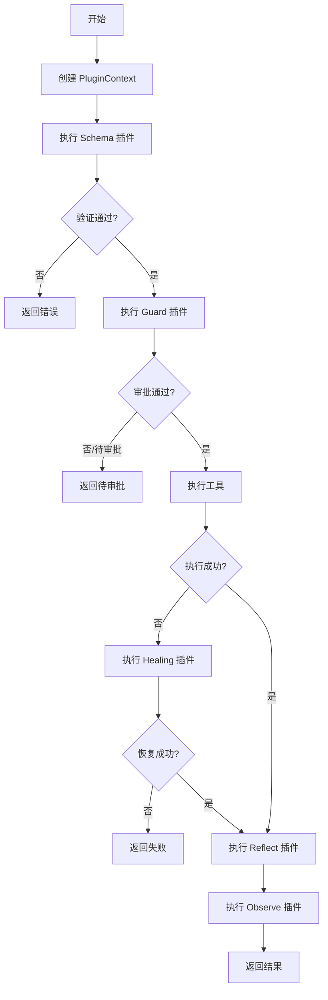

# Plugin System - 插件系统设计

**文档版本:** 1.0
**最后更新:** 2026-03-22
**状态:** Approved

---

## 1. 概述

SlotAgent 的插件系统是整个架构的核心,提供5层可插拔的插件槽位,支持工具级定制和灵活扩展。

### 1.1 设计目标

- **极小内核**: 核心引擎只负责调度,所有业务逻辑在插件中
- **松耦合**: 插件间通过标准接口协作,互不依赖
- **工具级定制**: 每个工具独立配置插件链,按需优化
- **可扩展**: 新增插件无需修改核心代码

### 1.2 核心概念

- **插件池 (PluginPool)**: 管理所有已注册插件的中心仓库
- **插件层 (Plugin Layer)**: 5个功能层级 (Schema/Guard/Healing/Reflect/Observe)
- **插件链 (Plugin Chain)**: 按顺序执行的插件序列
- **插件优先级**: 工具级插件配置优先于全局插件

---

## 2. 5层插件架构

### 2.1 插件层定义

| 层级 | 名称 | 职责 | 执行时机 | 典型插件 |
|------|------|------|--------|--------|
| 1 | Schema | 参数验证 | 工具执行前 | SchemaDefault, SchemaStrict |
| 2 | Guard | 权限控制 & 审批 | Schema 后 | GuardDefault, GuardHumanInLoop |
| 3 | Healing | 失败自愈 | 工具执行失败时 | HealingRetry, HealingFallback |
| 4 | Reflect | 任务反思 | 工具执行后 | ReflectSimple, ReflectStrict |
| 5 | Observe | 生命周期观测 | 全流程 | LogPlugin, MetricsPlugin |

### 2.2 执行顺序

```
用户请求
  ↓
Schema 验证
  ↓
Guard 护栏
  ↓
工具执行 ←─→ Healing 自愈 (失败时)
  ↓
Reflect 反思
  ↓
Observe 观测 (贯穿全流程)
  ↓
返回结果
```

### 2.3 插件层详细说明

#### Schema 层

**职责:**
- 验证参数格式和类型
- 参数归一化和转换
- 提供清晰的验证错误信息

**插件示例:**
- `SchemaDefault`: 基于 JSON Schema 的轻量验证
- `SchemaStrict`: 严格模式,包含业务规则验证

**输入:** `PluginContext` (带原始 params)
**输出:** `PluginResult` (validated=True 或验证错误)

#### Guard 层

**职责:**
- 权限检查 (白名单/黑名单)
- 风险评估
- 人工审批流程触发

**插件示例:**
- `GuardDefault`: 基于白名单/黑名单的简单控制
- `GuardHumanInLoop`: 高危操作人工审批
- `GuardPayment`: 支付场景特殊权限检查

**输入:** `PluginContext` (Schema 验证通过的 params)
**输出:** `PluginResult` (approved=True 或 pending_approval)

#### Healing 层

**职责:**
- 工具执行失败后自动重试
- Fallback 策略
- LLM 智能恢复

**插件示例:**
- `HealingRetry`: 固定间隔重试
- `HealingFallback`: 失败时调用备用工具
- `HealingLLM`: LLM 智能分析和恢复

**输入:** `PluginContext` + 失败信息
**输出:** `PluginResult` (recovered=True 或最终失败)

#### Reflect 层

**职责:**
- 验证工具执行结果是否符合预期
- 检查任务完成度
- LLM 反思和改进建议

**插件示例:**
- `ReflectSimple`: 基础结果检查
- `ReflectStrict`: 严格模式,包含业务规则验证
- `ReflectLLM`: LLM 评估任务完成质量

**输入:** `PluginContext` + 工具执行结果
**输出:** `PluginResult` (task_completed=True 或建议)

#### Observe 层

**职责:**
- 记录执行日志
- 收集性能指标
- 分布式追踪

**插件示例:**
- `LogPlugin`: 标准日志输出
- `MetricsPlugin`: Prometheus 指标收集
- `TracePlugin`: OpenTelemetry 分布式追踪

**输入:** `PluginContext` + 当前执行状态
**输出:** `PluginResult` (观测数据)

---

## 3. PluginPool - 插件池

### 3.1 职责

- 管理所有已注册插件
- 按层存储和查询插件
- 解析插件优先级 (工具级 > 全局)
- 验证插件配置有效性

### 3.2 数据结构

```python
class PluginPool:
    """插件池 - 管理所有已注册插件"""

    def __init__(self):
        # 全局插件配置: {layer: {plugin_id: plugin_instance}}
        self._global_plugins: Dict[str, Dict[str, PluginInterface]] = {
            'schema': {},
            'guard': {},
            'healing': {},
            'reflect': {},
            'observe': {}
        }

        # 工具级插件配置: {tool_id: {layer: plugin_id}}
        self._tool_plugins: Dict[str, Dict[str, str]] = {}
```

### 3.3 核心方法

```python
def register_global_plugin(self, plugin: PluginInterface) -> None:
    """
    注册全局插件。

    Args:
        plugin: 插件实例

    Raises:
        ValueError: 插件验证失败或ID冲突
    """

def register_tool_plugins(self, tool_id: str, plugins: Dict[str, str]) -> None:
    """
    注册工具级插件配置。

    Args:
        tool_id: 工具ID
        plugins: 插件配置,key为layer,value为plugin_id

    Raises:
        ValueError: plugin_id 未注册
    """

def get_plugin(self, layer: str, tool_id: Optional[str] = None) -> Optional[PluginInterface]:
    """
    获取插件实例 (优先级: 工具级 > 全局)。

    Args:
        layer: 插件层
        tool_id: 工具ID (可选)

    Returns:
        插件实例,如果不存在返回 None
    """

def get_plugin_chain(self, tool_id: str) -> List[PluginInterface]:
    """
    获取工具的完整插件链。

    Args:
        tool_id: 工具ID

    Returns:
        按执行顺序排列的插件列表
    """
```

### 3.4 插件优先级解析

**规则:** 工具级插件配置优先于全局插件

```python
# 示例
plugin_pool.register_global_plugin(SchemaDefault())  # 全局 Schema
plugin_pool.register_global_plugin(GuardDefault())   # 全局 Guard

# 工具级配置
plugin_pool.register_tool_plugins('payment_refund', {
    'schema': 'schema_strict',  # 覆盖全局配置
    'guard': 'guard_human_in_loop'  # 覆盖全局配置
})

# 查询插件
schema_plugin = plugin_pool.get_plugin('schema', 'payment_refund')
# 返回 schema_strict (工具级优先)

guard_plugin = plugin_pool.get_plugin('guard', 'weather_query')
# 返回 guard_default (使用全局配置)
```

### 3.5 插件链构建

```python
def get_plugin_chain(self, tool_id: str) -> List[PluginInterface]:
    """构建工具的完整插件链"""

    chain = []
    layers = ['schema', 'guard', 'healing', 'reflect', 'observe']

    for layer in layers:
        plugin = self.get_plugin(layer, tool_id)
        if plugin:
            chain.append(plugin)

    return chain
```

**示例:**
```python
# 轻量工具
weather_chain = plugin_pool.get_plugin_chain('weather_query')
# 返回: [SchemaDefault]

# 高危工具
payment_chain = plugin_pool.get_plugin_chain('payment_refund')
# 返回: [SchemaStrict, GuardHumanInLoop, HealingRetry, ReflectStrict, ObserveFull]
```

---

## 4. 插件链执行流程

### 4.1 标准执行流程



### 4.2 详细执行步骤

```python
def execute_plugin_chain(self, tool_id: str, params: Dict[str, Any]) -> ToolExecutionContext:
    """执行完整插件链"""

    # 1. 创建执行上下文
    context = ToolExecutionContext(
        tool_id=tool_id,
        tool_name=self._get_tool_name(tool_id),
        params=params,
        execution_id=str(uuid.uuid4()),
        status=ExecutionStatus.RUNNING,
        start_time=time.time()
    )

    # 2. 获取插件链
    plugin_chain = self.plugin_pool.get_plugin_chain(tool_id)

    # 3. 依次执行插件
    previous_results = {}

    for plugin in plugin_chain:
        # 创建插件上下文
        plugin_context = PluginContext(
            tool_id=context.tool_id,
            tool_name=context.tool_name,
            params=context.params,
            layer=plugin.layer,
            execution_id=context.execution_id,
            timestamp=time.time(),
            previous_results=previous_results
        )

        # 执行插件
        result = plugin.execute(plugin_context)

        # 记录结果
        context.plugin_results[plugin.layer] = result
        previous_results[plugin.layer] = result.data

        # 检查是否继续
        if not result.should_continue:
            if result.data and result.data.get('pending_approval'):
                context.status = ExecutionStatus.PENDING_APPROVAL
                context.approval_id = result.data['approval_id']
            else:
                context.status = ExecutionStatus.FAILED
                context.error = result.error
            return context

    # 4. 执行工具
    try:
        tool = self._get_tool(tool_id)
        final_result = tool.execute(context.params)
        context.final_result = final_result
        context.status = ExecutionStatus.COMPLETED

    except Exception as e:
        # 尝试 Healing
        healing_plugin = self.plugin_pool.get_plugin('healing', tool_id)
        if healing_plugin:
            # 执行 Healing 逻辑
            pass
        else:
            context.status = ExecutionStatus.FAILED
            context.error = str(e)

    # 5. 完成
    context.end_time = time.time()
    context.execution_time = context.end_time - context.start_time

    return context
```

### 4.3 插件间数据传递

插件通过 `previous_results` 共享数据:

```python
# Schema 插件
schema_result = PluginResult(
    success=True,
    data={'validated': True, 'normalized_params': {'location': 'beijing'}}
)

# Guard 插件访问 Schema 结果
def execute(self, context: PluginContext) -> PluginResult:
    schema_data = context.previous_results.get('schema', {})
    normalized_params = schema_data.get('normalized_params', context.params)

    # 使用归一化后的参数
    ...
```

---

## 5. 工具级定制示例

### 5.1 轻量工具 - 跳过大部分插件

```python
# 天气查询工具 - 仅需基础验证
weather_tool = ToolInterface(
    tool_id="weather_query",
    name="天气查询",
    input_schema={...},
    executor=get_weather,
    plugins={
        'schema': 'schema_default'  # 仅轻量验证
    }
)

# 插件链: [SchemaDefault]
# 执行速度快,开销小
```

### 5.2 高危工具 - 完整插件链

```python
# 支付退款工具 - 需要完整保护
payment_tool = ToolInterface(
    tool_id="payment_refund",
    name="支付退款",
    input_schema={...},
    executor=process_refund,
    plugins={
        'schema': 'schema_strict',         # 严格验证
        'guard': 'guard_human_in_loop',    # 人工审批
        'healing': 'healing_retry',        # 自动重试
        'reflect': 'reflect_strict',       # 严格反思
        'observe': 'observe_full'          # 完整观测
    }
)

# 插件链: [SchemaStrict, GuardHumanInLoop, HealingRetry, ReflectStrict, ObserveFull]
# 执行慢但安全可靠
```

---

## 6. 设计权衡

### 6.1 优势

- **灵活性**: 工具级定制,轻重分离
- **可扩展**: 新增插件无需修改核心
- **松耦合**: 插件间通过标准接口协作
- **渐进式**: 可从简单配置开始,逐步增强

### 6.2 劣势

- **复杂性**: 插件链配置需要理解各层职责
- **性能开销**: 完整插件链会增加延迟
- **调试难度**: 多层插件可能导致问题定位困难

### 6.3 缓解措施

- **默认配置**: 提供合理的默认全局插件
- **性能优化**: Observe 层异步执行,不阻塞主流程
- **调试工具**: 提供插件链可视化和日志追踪

---

## 7. 最佳实践

### 7.1 插件配置原则

1. **按需配置**: 轻量工具跳过不必要的插件
2. **风险分级**: 根据工具风险级别选择插件
3. **性能优先**: 高频工具避免重量级插件

### 7.2 插件开发规范

1. **单一职责**: 每个插件只做一件事
2. **无状态**: 插件不依赖实例状态
3. **幂等性**: 相同输入返回相同输出
4. **性能**: 插件执行时间 < 10ms (除非必要)

---

## 8. 变更历史

| 版本 | 日期 | 变更内容 |
|------|------|--------|
| 1.0 | 2026-03-22 | 初始版本,定义5层插件架构和 PluginPool 设计 |

---

**审批状态:** ✅ Approved
**审批人:** SlotAgent Core Team
**审批日期:** 2026-03-22
